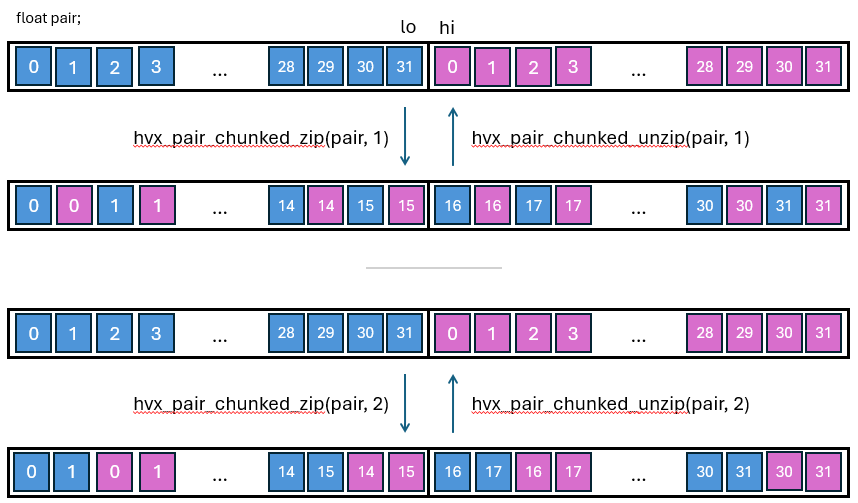
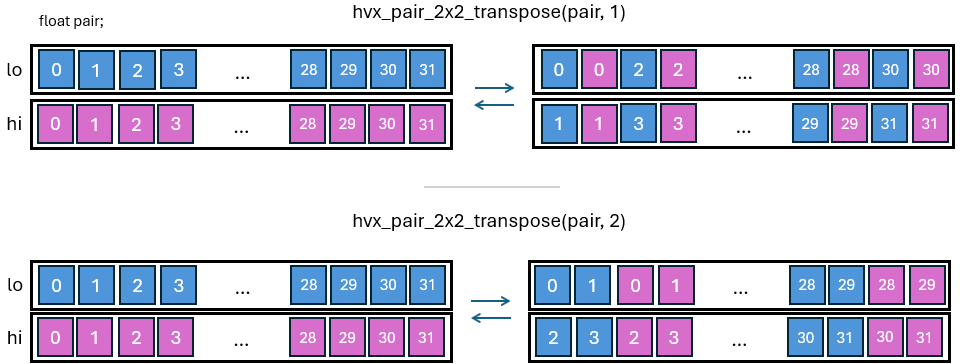

# Hexagon (R) HVX Optimization

This section is structured as a list of coding recommendations
in order to get competitive performance out of your Ripple programs.

# Optimization level

Ripple has been most tested with the `-O2` option on HVX,
which seems to be the most common optimization level.

```bash
clang -O2 ...
```

# Vector size parameters
Current versions of HVX ISAs tend to come with a register file of 32Kb total.
Please check the appropriate programmer's manuals for any specific information,
such as number and bit-width of registers,
about the particular architecture version you are compiling for.
The following block sizes illustrate single-vector block sizes
assuming a vector width of 1024 bits.

  | element type | i8/u8 | i16/u16/f16 | i32/u32/f32 |
  |--|--|--|--|
  | single-vector block size | 128 | 64 | 32 |


Since HVX instruction packets can contain up to four instructions, it is usually not useful to make the size of your block larger than four vectors.
For more information about VLIW slot usage, please consult the Hexagon HVX Programmer's Reference Manual (available on `docs.qualcomm.com`).

# Make the type of constants ("immediates") explicit
__Performance impact__: High.

One thing to remember when coding in Ripple, is that it maintains all semantical aspects of its underlying language.
One aspect of C that can impact performance in C and C++ is their __implicit type conversions__, and the __default type__ for its constants.

## Example
Consider the following function, which doubles the value of a `float` array.

```c
1:void double_me(float * A, unsigned n) {
2:  ripple_block_t b = ripple_set_block_shape(HVX_LANES, 32);
3:  ripple_parallel(b, 0);
4:  for (int i = 0; i <n; ++i) {
5:    A[i] = 2.0 * A[i];
6:  }
7:}
```

__Problem__: The `2.0` immediate is by default a `double` in C and C++.
Also, type promotion rules in C/C++ indicate that the multiplication line 5 is done after promoting both operands to the same type, `double`.
Hence, Ripple tries to produce a SIMD multiplication of 32 doubles.
However, current versions of HVX do not support SIMD
double-precision instructions.
As a result, the generated code is sequentialized, resulting in an order of magnitude slower performance than if SIMD could have been used.

__Solution__: Make the `2.0` immediate explicitly of the `float` type, using the `f` suffix.
```c
5:     A[i] = 2.0f * A[i];
```

The same issue can happen with integers, for which the default type is `int`, as in the following example:

```c
1:void double_me(short * A, unsigned n) {
2:  ripple_block_t b = ripple_set_block_shape(HVX_LANES, 64);
3:  ripple_parallel(b, 0);
4:  for (int i = 0; i <n; ++i) {
5:    A[i] = 2 * A[i];
6:  }
7:}
```
Here, the `2` line 5 is an `int`, and so is the subsequent multiplication,
because of type promotion rules in the C programming language.

__Solution__: convert it to short explicitly.

```c
5:    A[i] = ((short) 2) * A[i];
```
If you are using C++, precomputing it and forcing it to be a constexpr
will make sure that there is no extra cost to this conversion, as in the following code:
```c++
1:void double_me(short * A, unsigned n) {
2:  ripple_block_t b = ripple_set_block_shape(HVX_LANES, 64);
3:  constexpr short two = (short) 2;
3:  ripple_parallel(b, 0);
4:  for (int i = 0; i <n; ++i) {
5:    A[i] = two * A[i];
6:  }
7:}
```


# Optimizing floating-point code
## Use floating point types up to 32-bit wide (`float`) only
__Performance impact__: High.

Hexagon supports two native floating-point types: float and _Float16.
__bf16 is partially emulated.
There isn't currently a native HVX `double` vector ISA.
Hence, avoid double-precision computations in your vector codes,
which will come out as sequentialized.

## Leverage compiler flags
### Extended precision
__Performance impact__: Medium.

HVX allows extended-precision computations to happen in sequences of floating-point operations happening between memory accesses.
These are in a way more precise than IEEE floating-point, but they will result in a different numerical result from the same computation performed on IEEE floating point numbers.
It is possible to forgo of extended precision and be fully compatible with IEEE. However, this comes at a performance cost.

The use of fast, extended precision vs. slower, IEEE-compliant precision, is controlled by the following flag:
```bash
-mhvx-qfloat=<mode>
```

We refer to the HVX manual to describe the exact behavior of the following four modes:
- `strict-ieee` will give you full compatibility with IEEE floating point.
- `ieee` uses extended precision for some operations.
- `lossy` uses extended precision for more operations.
- `legacy` uses extended precision for almost all operations.

As of clang 21.0, the default is set to `lossy`.
__Warning__: the `lossy` option also implies other flags that impact precision, such as `-ffast-math`, which declares that floating-point (+, *) operations are commutative and associative, and that the data is free of `NaN`s and infinity.

### Working with finite values
__Performance impact__: Low.

clang is able to optimize some codes when you know that your floating-point values are always defined (they are not a NaN) and never infinite.
If you are in that case, use the `-ffinite-only` command-line flag.

### Relaxing the ordering of computations
__Performance impact__: Medium.

Addition and multiplication are commutative and associative for real numbers. This means that you can change the order in which a sequence of (for instance) additions (often called "reductions") are computed without changing the result.
Being able to change this order allows compilers to execute such sequences of operations faster.

Floating point numbers are an approximation for real numbers, and as a consequence, their operations aren't associative strictly speaking.
Changing the order of floating-point computations typically introduces some amount of precision error.

__Solution__ If your computation tolerates some amount of floating-point error, or if semantically that order does not matter for the resulting computation, you can let Ripple know it, using the following command-line flag:

```bash
clang -fassociative-math
```
This will speed up some computations, including reductions (expressed through the `ripple_reduce_*()` ripple API).

### Fast conversions from floating-point to integer
__Performance impact__: Low.

Conversion from floating-point (`Float` and `float` types) to integer
(`int16_t` and `int32_t`) can be slow,
as clang tries to implement it as precisely as possible.

__Solution__ Enable fast floating-point conversion,
which is very close semantically, but uses a single instruction.
To enable it, use the following command-line flag:

```bash
clang -mllvm -hexagon-fp-fast-convert=true ...
```

# Using ripple_shuffle on vector pairs
__Performance impact__: Medium.

We empirically noticed that shuffles on blocks of 2 vectors tend to
generate more efficient machine code.

# Inlining functions
__Performance impact__: High.

For an HVX target, there are significant overheads associated with function calls.
The overheads mostly arise from saving the register frame onto the stack
before the function call and loading the register frame from the stack
after the call returns.
Consequently, we advise the programmer to utilize clang's
["always_inline"](https://clang.llvm.org/docs/AttributeReference.html#always-inline-force-inline)
function attribute.
Avoid these overheads while maintaining code-readability as follows:

```C
 static int foo(int a, int b) __attribute__((always_inline)) {
    /// ...
  }
```

or in C++

```C++
static int foo(int a, int b) [[gnu::always_inline]] {
    /// ...
  }
```

# Functions optimized for HVX

## High-throughput data reordering (scatter/gather)
__Performance impact__: High.

Loading from a collection of arbitrary addresses into a vector
is by construction a long-latency operation,
as it can result in bank conflicts.
Hence, we do not recommend the direct use of non-coalesced access functions.

However, the Ripple vector library includes a
high-bandwidth memory-to-memory copying API for HVX,
which can move large amounts of data in parallel
(still with the same type of latency).

In cases where we cannot change our computations
to create coalesced data accesses, we can still rearrange our data into a set
that can be accessed in a coalesced way a bit later,
using the `hvx_gather/hvx_scatter` API.

### Syntax
```C
#include <ripple/HVX_Scatter_Gather.h>

void hvx_gather(T * dst, T * src, OFF_T offset, OFF_T region_size);
void hvx_scatter(T * dst, T src, OFF_T offset, OFF_T region_size);
```

These functions launch a high-throughput parallel data reorganization
from memory to memory.
`hvx_gather` and `hvx_scatter` are typically beneficial
to reorganize chunks of VTCM data (several or many vectors)
ahead of (for hvx_gather) or after (for hvx_scatter)
a computation that uses the reorganized data in a coalesced way.
The high latency that is inherent to arbitrary data reorganization is
amortized by the ability to run many of these vector reorg operations
concurrently.

There are two possible reorganizations
- collecting data from arbitrary locations to contiguous blocks
  in memory, so that later code can work
  with coalesced loads and stores: `hvx_gather`.
- distributing contiguous data to arbitrary locations: `hvx_scatter`.
  This is often done after performing computations on the data in their
  contiguous form (i.e., efficiently).

`hvx_gather` and `hvx_scatter` are affected by conditionals
(they become a masked gather or scatter)

`offset` represents the offsets in number of elements,
(as opposed to number of bytes), which are added to `src` for `hvx_gather`
and `dst` for `hvx_scatter`.
For instance if `T` is `int16_t`, the source byte offset is `2*src_offset`.

`region_size` represents the number of elements in the region,
on the non-coalesced side of the transfer.
Any address going out of that region is ignored
(the transfer of the addressee does not happen).

Notice how `hvx_gather` and `hvx_scatter` effectively offer
three ways to mask element data transfers:
- through masking (using them in a conditional),
- through the use of a negative index (preventing underflows), and
- through the `region_size` parameter (preventing overflows).

Masking makes the program more readable as it makes this behavior explicit.
On the other hand,
it also introduces a mask computation, which could add
latency to the data transfer.

Use cases for scatter-gather include indirections (`A[B[i]]`),
large lookup tables, sparse-dense array computations (for instance sparse matrix dense vector multiplication), and strided data accesses, particularly when the data access stride is large (e.g. when accessing element of a large array along columns).

### Example 1: dense matrix x sparse vector
Let us look at a dense-sparse vector inner product
(more often found inside "SpMV", sparse-matrix-dense-vector products).
The sparse vector `S` is accompanied with an index (`S_index`),
representing the coordinates of its non-zero elements.
Let the dense vector be named `V`.

Let's start with a straightforward implementation.
Since we only want to perform the multiplications for which S is non-zero,
we select the corresponding elements in `V`:
```C
float SpVV(float * S, int32_t * S_index, size_t nS, float * V) {
  ripple_block_t BS = ripple_set_block_shape(HVX_PE, 32);

  float result = 0.f;
  ripple_parallel(BS, 0);
  for (size_t i = 0; i < nS; ++i) {
    result += S[i] * V[S_index[i]];
  }
  return ripple_reduceadd(0b1, result);
}
```
Unfortunately, when vectorized, the indirection in `V[S_index[i]]` translates
to vector gathers, which are very inefficient.
In particular, they introduce long latencies in the innermost computational
loop.
These latencies tend to add up at each loop iteration, making the overall loop
slow.

The idea here is to still do long-latency gathers, but do a lot of them
in parallel by using `hvx_gather`
to make all accesses in the inner product loop coalesced.
To simplify the following code, we assume the existence of `vtcm_malloc()` and
`vtcm_free()` functions.
```C
float SpVV(float * S, int32_t * S_index, size_t nS, float * V, size_t nV) {
  ripple_block_t BS = ripple_set_block_shape(HVX_PE, 32);
  float * gathered_V = vtcm_malloc(sizeof(float) * nS, /*align_as=*/128);
  ripple_parallel(BS, 0);
  for (size_t i = 0; i < nS; ++i) {
    hvx_gather(gathered_V, i, V, S_index[i], /*region_size=*/nV);
  }

  float result = 0.f;
  ripple_parallel(BS, 0);
  for (size_t i = 0; i < nS; ++i) {
    result += S[i] * gathered_V[i];
  }
  vtcm_free(gathered_V);
  return ripple_reduceadd(0b1, result);
}
```

Since all addresses in the `hvx_gather` loop are conflict-free,
all the data reorganization is done in parallel (up to the limits offered by
the underlying HVX hardware).
Assuming the possibility to run `nS / 32` reorg copies at once,
we are only paying the latency of one copy in the `hvx_gather` loop.
The subsequent inner product loop is optimal in terms of its load/store
latencies, which are all coalesced.

### Constraints
`hvx_gather` and `hvx_scatter` have very specific semantics,
  to be enforced by the developer:
- Both `src` and `dst` have to lie in local memory (VTCM)
- In hvx_gather, `dst` needs to be aligned on a HVX vector boundary.
- `T` can be any base type.
- `OFF_T` can be `int16_t` or `int32_t`.
   Its bitwidth has to match that of the elements being transferred.
  Notice how this limits the offset values to 32767 in the `int16_t` case.
- Transfers of elements for which the index is negative are ignored.
- Addresses in a (hardware) vector transfer cannot cross VTCM page boundary.
  VTCM page size depends upon the configuration.
  As time of writing, it is typically 4 or 8 MB,
  or less if the VTCM is smaller than 4MB.
- The ripple block size must be such that each call to hvx_gather or
  hvx_scatter transfers one native HVX vector.


## Explicit bfloat16 conversions
__Performance impact__: High.

```C
#include <ripple/HVX_Bfloat.h>

__bf16 to_bf_trunc(float x);
__bf16 to_bf_nan(float x);
__bf16 to_bf_round(float x);
```

Ripple supports three types of conversions from `float` to `__bf16`:
- `to_bf_trunc`, a direct truncation
- `to_bf_nan`, a truncation that avoids incorrect NaN conversions (they can become an infinity using the direct shift)
- `to_bf_round`, a conversion that performs an even rounding and avoids incorrect Nan conversions. The behavior of this conversion is compatible with x86 bfloat conversion.

## Dynamic rotations
__Performance impact__: Low.

### Syntax
```C
#include <ripple/HVX_Rotate.h>

T hvx_rotate_to_lower(T, int32_t n);
```
where T is a base C type.

`hvx_rotate_to_lower` is a rotation across elements of a
block (interpreted as a one-dimensional block).
If B is the block size,
`hvx_rotate_to_lower(x, n)` moves element `k` of `x`
from index `k` to index `k - n modulo B`.
Values of `n` must be between 0 and B - 1.

Since `hvx_rotate_to_lower` is cyclic w.r.t. `n`, we can write a "`hvx_rotate_to_higher(x, n)`" as `hvx_rotate_to_lower(x, B - n)`.

### Example 1
The following code snippet:

```C
ripple_block_t BS = ripple_set_block_shape(VECTOR_PE, 8);
char alphabet = 'a' + ripple_id(BS, 0);
char rotated_alphabet = hvx_rotate_to_lower(alphabet, 2);
```

 creates `alphabet`, a 8-element block with letters `a` to `h`

| `a` | `b` | `c` | `d` | `e` | `f` | `g` | `h` |

and then rotates it down by 2 elements, giving the following block:

| `c` | `d` | `e` | `f` | `g` | `h` | `a` | `b` |


### Example 2: Partial prefix sum

In the code below, we use it to implement a partial prefix sum
in a the `sum` vector.
This means that the `k`-th element in `sum` contains the sum of all elements
in `input` from `0` to `k`.

Each iteration of the `step` loop sums each vector element of index `k` of `sum`
with the element of index `k-step` for all `k`'s greater than `step`.
This is done by rotating `sum` _up_ by `step` indices.

To rotate up, recall that `rotate` is cyclical,
hence rotating by `block_size - step` towards lower indices
is equivalent to rotating by `step` toward upper indices.

The first iteration (`step=1`) computes the sum of each element with its direct
neighbor.
The second one sums pairs (leaving the first pair alone using
`(v >= step)`), then quads, etc.

The resulting partial sum vector is then stored into the `output` array.

```C
#define VECTOR_PE 0
#define VECTOR_SIZE 32
void partial_prefix_sum(int32_t input[VECTOR_SIZE], int32_t output[VECTOR_SIZE]) {
  ripple_block_t BS = ripple_set_block_shape(VECTOR_PE, VECTOR_SIZE);
  size_t block_size = ripple_get_block_size(BS, 0);
  size_t v = ripple_id(BS, 0);

  int32_t sum = input[v];
  for (size_t step = 1; step < block_size; step *= 2) {
    // Shifts to upper by 'step' and adds
    sum += (v >= step) ? hvx_rotate_to_lower(sum, block_size - step) : 0;
  }
  output[v] = sum;
}
```

`hvx_rotate_to_lower` can be used on multi-dimensional blocks, in which case
the block will be interpreted as one-dimensional (basically, flattened)
during the rotation.

### Constraints
- `hvx_rotate_to_lower` works on blocks that map to a single HVX vector.
- `TYPE` can be any one of `(u?)int(8|16|32|64)_t` and `_Float16/float/double`.
        i.e., `dst[i] = src[(i + n) % get_size(N)]`
        where `N` is the total size of the block.


## Narrowing shifts
__Performance impact__: Medium.

### Syntax
```C
#include <ripple/HVX_Narrow_Shift.h>

narrow_t hvx_narsh[[_rnd]_sat][_noshuff](wide_t odd, wide_t even, uint32 shift);
```

A narrowing shift (or "narsh") is an operation on integers,
which performs a right shift followed by a conversion
to a smaller integer type.
The conversion can be done by truncation or using saturation (using the function name suffix `_sat`).
When saturation is used, we can also request rounding up, using the
`_sat_rnd` suffix.
The shift amount sh is the same for all elements of the block.

Two forms are supported. The first, faster form takes two inputs, performs a narrowing shift, and shuffles the resulting block.
The second form, suffixed with `_noshuff`, doesn't shuffle the result.

### Supported source and destination types __

  | wide (source) type | narrow (destination) type|
  |--------------------|--------------------------|
  | i32 (int32_t)      | i16, u16                 |
  | u32 (uint32_t)     | u16                      |
  | i16 (int16_t)      | i8, u8                   |
  | u16                | u8                       |


An interesting aspect of this function is that it packs
the narrowed by pairs, i.e. two 32-bit integers get narrowed and packed into one 32-bit integer.

### Examples
```C
int16_t hvx_narsh_sat_i16toi8(int16_t odd, int16_t even, uint32_t shift);
uint32_t hvx_narsh_rnd_sat_u32tou16_noshuff(uint32_t odd, uint32_t even, uint32_t shift);
```

### Constraints
hvx_narsh works on block sizes that occupy a full HVX vector.


## Vector splicing
__Performance impact__: High.

### Syntax
```C
#include <HVX_Splice.h>

T hvx_splice(T low, T high, size_t n);
T hvx_lsplice(T low, T high, size_t n);
```

This is a _flat_ operator, which means that it considers a block as being
one-dimensional.
Hence, we describe blocks here as "vector"s.
The difference between `hvx_splice` and `hvx_lsplice` is which argument we take `n` elements from.
- `hvx_splice` forms a vector from two vectors `high` and `low`.
Let's call `N` the number of elements in the vector.
The returned vector contains
the `n` lowest elements of `high` as its highest elements,
and the `N-n` highest elements of `low` as its lowest elements.

- `hvx_lsplice` ("low splice") forms a vector from two vectors `high` and `low`.
The returned vector contains
the `n` highest elements of `low` as its lowest elements,
and the `N-n` lowest elements of `high` as its highest elements.

This behavior is illustrated on Figure H1.

__Figure H1.__ hvx_splice/hvx_lsplice behavior

__Note__: An implicit "modulo N" is applied to `n`, to ensure sound semantics.

Typical uses for `hvx_splice` are codes that use overlapping windows of tensors,
for example in stencils, convolutions and pooling.
Example 2 will be a sliding window, a 1-dimensional Gaussian blur.

`hvx_splice` is also sometimes used to implement padding, as shown in Example 1.

### Example 1
We need to add two arrays, but only one of them has a size
that is a multiple of the HVX vector size (here called `HVX_SIZE_U16`).

```C++
#include <ripple/HVX_Splice.h>
template <typename T>
static void padded_add(size_t n, const T *in1_padded, const T *in2_unpadded,
                       T *out_padded, bool lower) {
  constexpr size_t nv = __HVX_LENGTH__ / sizeof(T);
  ripple_block_t B = ripple_set_block_shape(0, nv);
  assert(n % nv == 0);
  unsigned v = ripple_id(B, 0);
  T zero = ripple_broadcast(B, 0b1, static_cast<T>(0.f));
  // full-vector loop
  unsigned i;
  for (i = 0; i + nv < n; i += nv) {
    out_padded[i + v] = in1_padded[i + v] + in2_unpadded[i + v];
  }
  // Epilogue using hvx_lsplice (pad remainder of in2 with zeros)
  // There aren't enough elements in in2_unpadded to add with.
  // We're splicing that partial vector with a vector of zeros
  if (lower) {
    out_padded[i + v] =
        in1_padded[i + v] +
        // to specify the #elements taken from the lower vector --> lsplice
        hvx_lsplice(/*low=*/in2_unpadded[i + v - 3], /*high=*/zero, nv - 3);
  } else {
    out_padded[i + v] =
        in1_padded[i + v] +
        // to specify the #elements taken from the upper vector --> splice
        hvx_splice(/*low=*/in2_unpadded[i + v - 3], /*high*/ zero, 3);
  }
}
```

Note that the same effect can be obtained using conditionals in this case.
The epilogue code in `padded_add` below could be replaced with the following
code to obtain the same result.
```C++
  out_padded[i + v] = in1_padded[i + v] + (i + v < n) ? in2_unpadded[i + v] : 0;
```
The difference between the two lies in the use of predicate registers
in the latter.
The sequence of instructions for the original padded_add epilogue are roughly:
- Compute `n - i` (a scalar).
- Top off `in2_unpadded` with zeros using `hvx_lsplice`.
- Add `in1_padded` with the combined vector

The sequence of instruction for the conditional-based version is roughly:
- Compute the vector predicate for the expression `i + v < n`.
- Select the elements from the zero-vector and `in2_unpadded`
  as specified in the vector predicate.
- Add `in1_padded` with the resulting vector

While the number of steps seems comparable,
computing predicates can be more expensive than computing non-predicates.
Hence in this case, the version based on `hvx_lsplice` is generally preferred.

### Example 2
Stencil operations are often used to write filters,
or iteratively solve partial differential equations.

The following code is a simple gaussian blur operating on a 1-d signal:

```C++
void gaussian_blur(size_t n, float * in, float * out) {
  constexpr float one_third = 1.f/3.f;
  out[0] = in[0] + in[1];
  for (size_t i = 1; i < n - 1; ++i) {
    out[i] = (in[i - 1] + in[i] + in[i + 1]) * one_third;
  }
  out[n - 1] = in[n - 2] + in[n - 1];
}
```
A naïve vectorization can be obtained by decorating the `i` loop with
`ripple_parallel`.
No matter how `in` and `out` are align, at least two of the loads of `in`
will be unaligned.
We can do better by using only aligned loads and stores.

```C++
void gaussian_blur(size_t n, float * in, float * out) {
  constexpr float one_third = 1.f/3.f;
  constexpr size_t hvx_bytes = __HVX_LENGTH__;
  constexpr size_t nv = hvx_bytes / sizeof(float);
  ripple_block_t B = ripple_set_block_shape(HVX_LANES, nv);
  size_t v = ripple_id(B, 0);
  in = ripple_ptr_alignment(&in[0], hvx_bytes);
  out = ripple_ptr_alignment(&out[0], hvx_bytes);
  float zero = ripple_broadcast(B, 0b1, static_cast<T>(0.f));

  // prologue
  if (n <= nv) { // special case of a single vector
    out[v] =
        (hvx_lsplice(zero, in[v], 1) + in[v] +
          hvx_splice(in[v], zero, 1)) * one_third;
    return;
  }
  out[v] =
      (hvx_lsplice(zero, in[v], 1) + in[v] + hvx_splice(in[v], in[nv + v], 1)) *
      one_third;

  // Steady-state
  size_t i;
  for (i = nv; i + nv < n; i += nv) {
    out[i + v] = (hvx_lsplice(in[i - nv + v], in[i + v], 1) +
                  in[i + v] +
                  hvx_splice(in[i + v], in[i + nv + v], 1)) *
                 one_third;
  }

  // Epilogue (last vector)
  out[i + v] = (hvx_lsplice(in[i - nv + v], in[i + v], 1) +
                in[i + v] +
                hvx_splice(in[i + v], zero, 1)) *
               one_third;
}
```

The code above is faster than the original code,
because it only involves aligned loads and stores.

We can make it even faster by noticing that consecutive iterations of `i`
reuse two of the three input vectors.
Hence, instead of re-loading these two vectors,
we can just reuse them from the previous iteration.
This reuse technique, often called "register rotation,"
is applied to `gaussian_blur` below.

```C++
void gaussian_blur(size_t n, float * in, float * out) {
  constexpr float one_third = 1.f/3.f;
  constexpr size_t hvx_bytes = __HVX_LENGTH__;
  constexpr size_t nv = hvx_bytes / sizeof(float);

  ripple_block_t B = ripple_set_block_shape(HVX_LANES, nv);
  size_t v = ripple_id(B, 0);
  in = ripple_ptr_alignment(&in[0], hvx_bytes);
  out = ripple_ptr_alignment(&out[0], hvx_bytes);
  float zero = ripple_broadcast(B, 0b1, static_cast<T>(0.f));

  // prologue
  if (n <= nv) { // special case of a single vector
    out[v] =
        (hvx_lsplice(zero, in[v], 1) + in[v] +
          hvx_splice(in[v], zero, 1)) * one_third;
    return;
  }
  float next_in = in[nv + v];
  float cur_in = in[v];
  out[v] =
      (hvx_lsplice(zero, cur_in, 1) + cur_in + hvx_splice(cur_in, next_in, 1)) *
      one_third;

  // Steady-state
  size_t i;
  float prev_in;
  for (i = nv; i + nv < n; i += nv) {
    prev_in = cur_in; // register rotation
    cur_in = next_in; // register rotation
    next_in = in[i + nv + v];
    out[i + v] = (hvx_lsplice(prev_in, cur_in, 1) +
                  cur_in +
                  hvx_splice(cur_in, next_in, 1)) *
                 one_third;
  }

  // Epilogue (last vector)
  prev_in = cur_in;
  cur_in = next_in;
  out[i + v] = (hvx_lsplice(prev_in, cur_in, 1) +
                cur_in +
                hvx_splice(cur_in, zero, 1)) *
               one_third;
}
```


Let `V` the number of HVX vectors in `in`.
With this transformation, the total number of vector loads from `in` went from
about `3*V` to `V`, without adding any work, a clear performance win.
As always with Ripple, the compiler may be able to perform loop optimizations that are competing with or similar to register rotations.
The speedup you will get will depend upon how successful clang was with its own optimizations.

### Constraints
`high` and `low` shapes must correspond to
the number of elements in one HVX Vector.

## Chunked zipping and unzipping for pairs of HVX vectors
__Performance impact__: Medium.
### Syntax
```C
#include <ripple/HVX_VectorPair.h>

T hvx_pair_chunked_zip(T x, size_t chunk_size);
T hvx_pair_chunked_unzip(T x, size_t chunk_size);
T hvx_pair_chunked_zip_list(T x, size_t chunk_size, size_t list_size);
T hvx_pair_chunked_unzip_list(T x, size_t chunk_size, size_t list_size);
```

`hvx_pair_chunked_zip` and `hvx_pair_chunked_unzip`
are useful data-dependent data reindexing functions
for block sizes that correspond to 256 bytes.
For example, if the chunk size parameter `chunk_size` is used in a loop.
Data reorganization following a constant patterns can always be achieved using
`ripple_shuffle()` or `ripple_shuffle_pair()`.

The `zip` and `unzip` terms are defined as in python.
- `hvx_pair_chunked_zip` considers the input `x` to be a pair
  of sequences of chunks of size `chunk_size.
  It returns a corresponding ("zipped") sequence of pairs (of chunks).

  Explained from a tensor perspective,
  `x` can be seen as a `chunk_size x n x 2` tensor,
  whose last two dimensions gets transposed, into a `chunk_size x 2 x n` tensor.

- `hvx_pair_chunked_unzip` is the opposite operation:
  the input block is considered as a sequence of pairs of chunks,
  and the output block is the corresponding pair of sequences of chunks.

  Explained from a tensor perspective,
  `x` can be seen as a `chunk_size x 2 x n` tensor,
  whose last two dimensions gets transposed, into a `chunk_size x n x 2` tensor.

- `hvx_pair_chunked_zip_list` considers `x` to be a pair of _lists_ of sequences
  of chunks.
  The sequence size `S` inside each list is defined by `chunk_size`
  and `list_size` as `128 / sizeof(T) / chunk_size / list_size`.
  For each list index, it zips both indexed input list elements
  into a list of sequences of `S` zipped pairs of `chunk_size`-sized chunks.

  Seen as a tensor, the input shape would be `chunk_size x S x list_size x 2`,
  while the output shape would be `chunk_size x 2 x S x n_lists`.

- `hvx_pair_chunked_unzip_list` performs the opposite operation.
  It considers `x` to be a _list_ of sequences of pairs of chunks.
  The input is a list of sequences of pairs of chunks, and
  the output is a pair of lists of sequences of chunks.
  The sequence size `S` inside each list is defined by `chunk_size` and
  `list_size` as `128 / sizeof(T) / chunk_size / list_size`.
  For each list index, `hvx_pair_chunked_unzip_list` unzips pairs of chunks in
  the indexed input sequence into two sequences that are indexed in each element
  of the output pair of lists.

  Seen as a tensor, the input shape would be `chunk_size x 2 x S x list_size`,
  while the output shape would be `chunk_size x S x n_lists x 2`.

The behavior of `ripple_pair_chunked_zip` and `ripple_pair_chunked_unzip`
is illustrated on Figure H2.


__Figure H2.__ hvx_pair_chunked_zip/unzip behavior

### Constraints
- `x`'s shape must fit exactly a pair of HVX vectors.
- `chunk_size` has to be a power of 2 and can be up to `32 / sizeof(T)`.
- `list_size` must also be a power of two.

To use hvx_pair_chunked_zip/unzip with multi-dimensional blocks, use `ripple_reshape`.

## 2x2 subtensor transposition for pairs of HVX vectors
__Performance impact__: Medium.

### Syntax
```C
#include <ripple/HVX_VectorPair.h>

T hvx_pair_2x2_transpose(T a, size_t chunk_size);
T hvx_pair_2x2 transpose_inc(T a, size_t chunk_sizes);
T hvx_pair_2x2_transpose_dec(T a, size_t chunk_sizes);
```

- `hvx_pair_2x2_transpose` considers `a` as a `chunk_size x 2 x n x 2` tensor,
  where `chunk_size` is a power of two.
 The returned block is obtained by transposing the second and fourth dimensions,
 i.e., transposing `2x2` sub-tensors of element size `chunk_size`.
 `n = 64 / chunk_size`.

- `hvx_pair_2x2_transpose_inc` and `hvx_pair_2x2_transpose_dec`
  accept a non-power of two `chunk_sizes` parameter.
  However, it does not interpret `chunk_sizes` as a single chunk size,
  but instead as a sequence of chunk sizes for which the subtensor transposition
  defined by `hvx_pair_2x2_transpose` must be applied.
  Each bit set in `chunk_sizes` defines a power-of-two chunk_size to be applied
  in that sequence.
  - `hvx_pair_2x2_transpose_inc` applies the transpositions hierarchically
    by increasing order of chunk sizes, while `hvx_pair_2x2_transpose_dec`
    applies the transpositions hiearchically by decreasing order of chunk sizes.

The behavior of `hvx_pair_2x2_transpose` is illustrated on Figure H3.


__Figure H3.__ hvx_pair_2x2_transpose behavior


### Constraints
- `x`'s shape must be 1-d and fit exactly a pair of HVX vectors.
- In `hvx_pair_2x2_transpose()`, `chunk_size` must be a power of two,
  and is limited to `32 / sizeof(T)`.

To use hvx_pair_2x2_transpose with multi-dimensional blocks, use `ripple_reshape`.

---
*Copyright (c) 2024-2026 Qualcomm Innovation Center, Inc. All rights reserved.
SPDX-License-Identifier: BSD-3-Clause-Clear*
